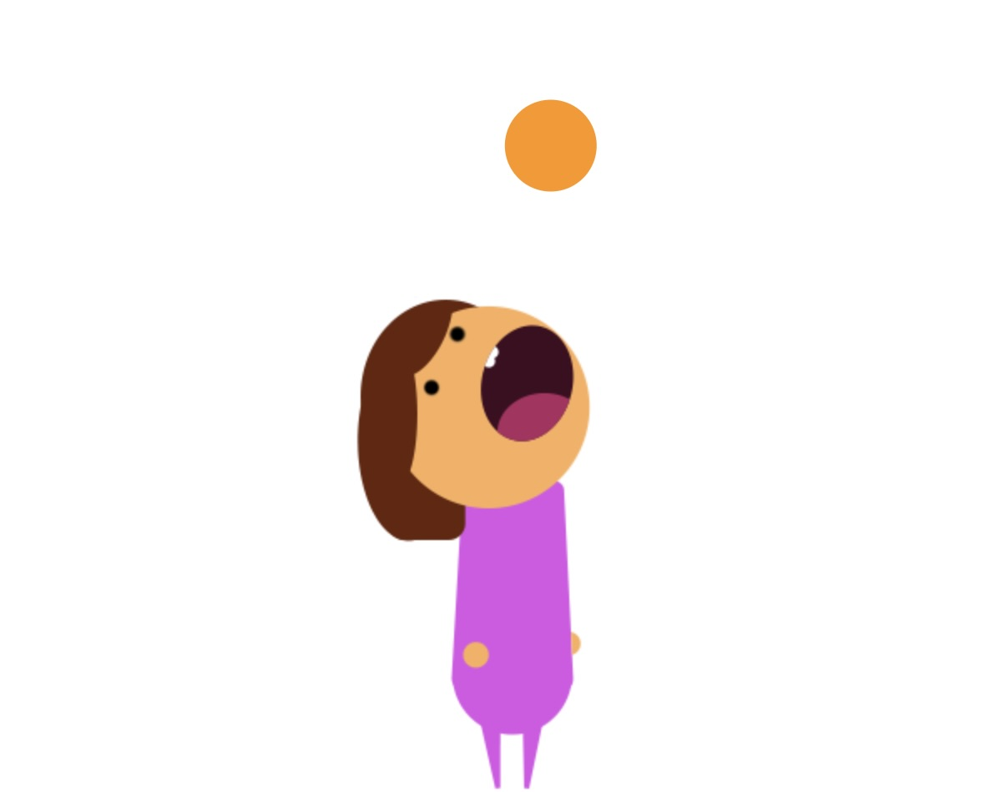

# 'Orange Catcher🍊' Game
Developed by Wan Pui Kwok 

# Goal
Eat 10 oranges within 20 seconds!

# How to play
`A` `S` `D` `F` `G` `H` `J` `K` `L` 
- Swipe the row with 'KeyA', 'KeyS', 'KeyD', 'KeyF', 'KeyG', 'KeyH', 'KeyJ', 'KeyK' and 'KeyL' to left and right to control the player's movement

`E` 
- Tap 'KeyE' to eat the orange when the orange overlaps the player

# Game characteristics
1. Oranges fall from different positions from the sky randomly
2. The speed of falling oranges is increased every time

# Good Luck :O
I hope you can eat 10 oranges! 🍊🍊🍊🍊🍊🍊🍊🍊🍊🍊